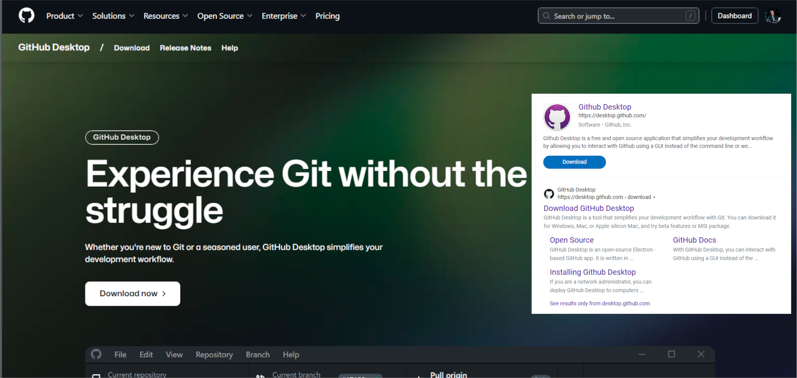
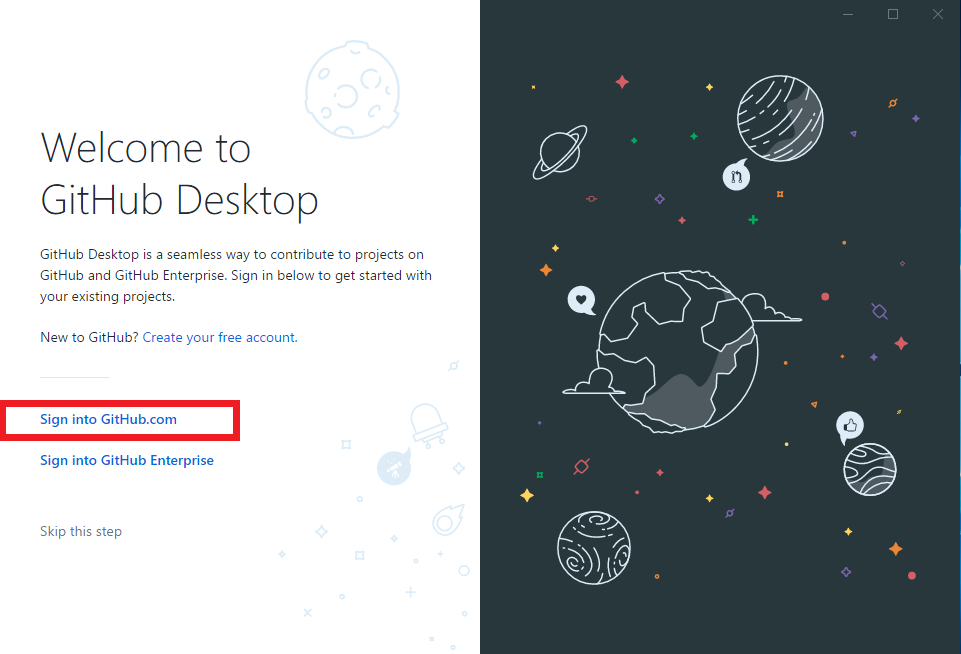
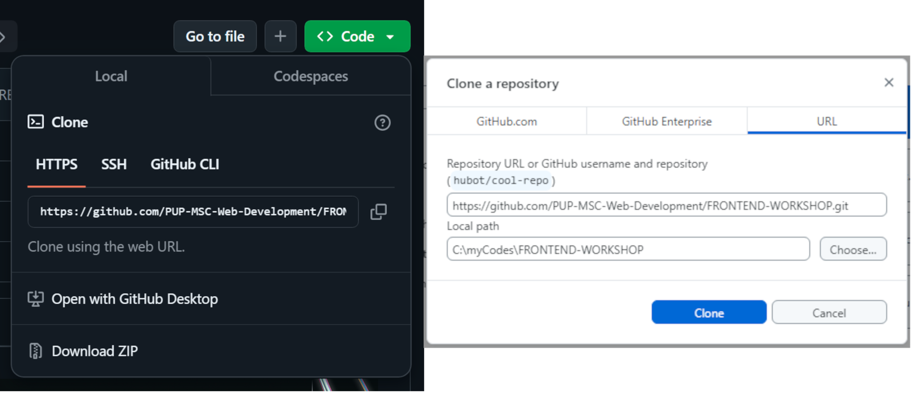
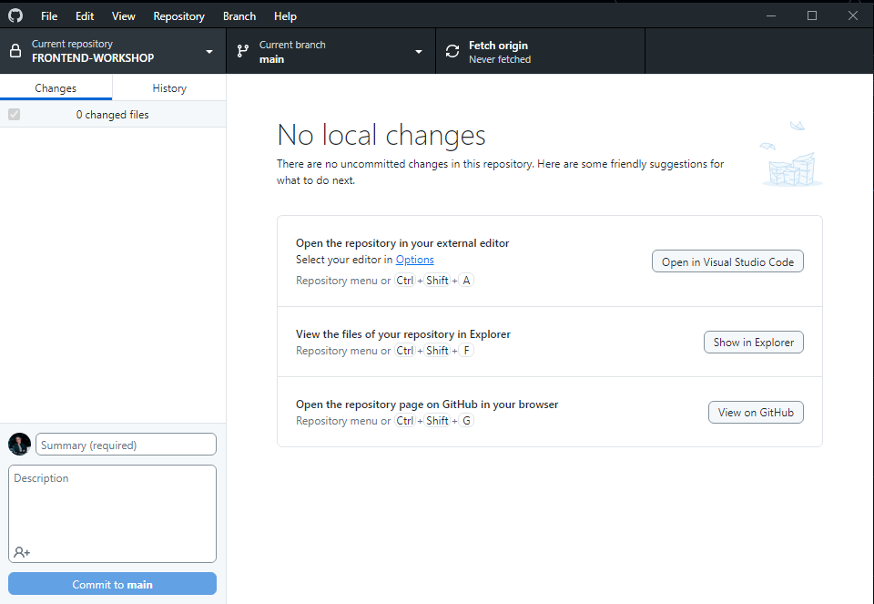

<div align="center">
  
  <h1>
    .·´¯`·.·★ 😘 𝘾𝙇𝙄𝘾𝙆 𝙈𝙀, 𝙃𝙊𝙑𝙀𝙍 𝙈𝙀, 𝙇𝙊𝙑𝙀 𝙈𝙀! 😍 ★·.·`¯´·.
  </h1>
  <div style="display: flex; justify-content: center; gap: 40px; align-items: center;">
    
    
    
  </div>
</div>

Welcome to PUP MSC's Frontend Web Development Training Repository where love at first click is just the beginning! Whether you're rekindling your passion for HTML, having a fling with CSS, or diving deep into a committed relationship with JavaScript, these reinforcement exercises are designed to make your coding journey unforgettable. 💘

________________

## Frontend Workshop Labs  

Welcome to the **Frontend Workshop Labs** repository! This repository provides hands-on exercises to learn HTML, CSS, and JavaScript fundamentals.  

### Key Components  
1. **Documentation**: Learn core concepts.  
2. **Exercises**: Practice activities.  
3. **Knowledge Check**: Quiz available on Dropbox.  

### Lab Topics  
- **HTML Lab**: Semantic structure, lists, links, and images.  
   - Exercises: Survey Form, Tribute Page.  
- **CSS Lab**: Selectors, box model, flexbox.  
   - Exercises: Login Form, Pricing Cards.  
- **JavaScript Basics**: Variables, operators, control structures.  
   - Exercises: Console games, Temperature Converter.  
- **JavaScript Advanced**: DOM manipulation, events.  
   - Exercises: Dynamic Counter, Calculator Web App.  

---

## Repository Structure  
``` Bash
> 📁 Assets
˅ 📂 Documentations 
  > 📁 CSS 
  > 📁 Html 
  > 📁 JavaScript 
    🗎  README.md 
˅  📂 Exercises
  > 📁 CSS-Exercises
  > 📁 Html-Exercises
  > 📁 JavaScript-Exercises
    🗎  README.md
🗎  README.md

| Folder/File             |  Purpose                                                      |
|-------------------------|---------------------------------------------------------------|
| `FRONTEND-WORKSHOP/`    | Main project folder.                                          |
| `Assets/`               | Folder that stores images for guides and tutorials.           |
| `Documentations/`       | Contains Learning materials for Html, Css, and JavaScript.    |
| `Exercises/`            | Practice exercises for Frontend Technologies.                 |
| `README.md`             | Folder to store images for guides and tutorials.              |

```
---

## Setup Instructions  
1. **Install GitHub Desktop**: Download and install.
   
     
     
2. **Sign In**: Use your GitHub credentials.
   
     
     
3. **Clone Repository**: Copy the URL and clone using GitHub Desktop or click the "Open with Github Desktop".
   
     
     
4. **Access Files**: Navigate to the cloned files, you may now access the repository via vs Code or file Explorer.
   
     


---

## Contributors  
Special thanks to:  
- **[Rhandie Sales Jr.](https://github.com/Rheen0)**  
- **[Jhon Roy Ilao](https://github.com/jhonroyilao)**  
- **[Adriel Magalona](https://github.com/adr1el-m)**  
- **[Lovely Nablo](https://github.com/Lovely2113)**  
- **[Johannah Agapito](https://github.com/joejhbb)**  
- **[Angelo Rodelas](https://github.com/Gelatino0308)**  
- **[Janine Lureñana](https://github.com/janinelurenana)**  

---

## Join the Community  

Follow us for updates and support:  
- **[Facebook](https://www.facebook.com/p/PUP-Manila-Microsoft-Student-Community-100089030690536/)**  
- **[LinkedIn](https://www.linkedin.com/company/pup-manila-microsoft-student-community/posts/?feedView=all)**  
- **[YouTube](https://www.youtube.com/channel/UCg_NgTkhjb7-_dOiuzUIawAl)**  
- **[GitHub](https://github.com/PUP-MSC-Web-Development)**  

---

Happy Learning! 🎉  
