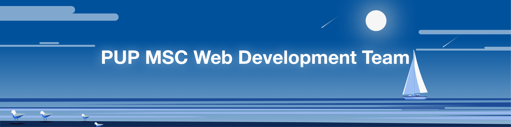

  <h1>
    .·´¯`·.·★ 😘𝘾𝙇𝙄𝘾𝙆 𝙈𝙀, 𝙃𝙊𝙑𝙀𝙍 𝙈𝙀, 𝙇𝙊𝙑𝙀 𝙈𝙀!😍 ★·.·`¯´·.
     
 

     
 

  </h1>
 

<h2>Welcome to PUP MSC's Frontend Web Development Training Repository where love at first click is just the beginning! Whether you're rekindling your passion for HTML, having a fling with CSS, or diving deep into a committed relationship with JavaScript, these reinforcement exercises are designed to make your coding journey unforgettable. 💘</h2>

________________

Welcome to the **Frontend Workshop Labs** repository! This repository contains hands-on exercises for learning the basics of frontend development using HTML, CSS, and JavaScript.

Each section includes:
- **Documentation**: Read through to understand key concepts.
- **Exercises**: Practical activities to implement the concepts.
- **Knowledge Check**: A quiz to reinforce your understanding (Provided on the dropbox).

## Lab Topics

### 1. HTML Lab
- **Key Topics**: Semantic structure, headings, lists, links, and images.
- Exercises:
  1. Simple Profile Page (example exercise, can be changed)
  2. Product Listing Page (example exercise, can be changed)
  3. + add more if you can

### 2. CSS Lab
- **Key Topics**: Selectors, properties, box model, and flexbox.
- Exercises:
  1. Styled Card Design (example exercise, can be changed)
  2. Flexbox Layout (example exercise, can be changed)
  3. + add more if you can

### 3. JavaScript Basics Lab
- **Key Topics**: Variables, data types, operators, and control structures.
- Exercises:
  1. Basic Calculator (example exercise, can be changed)
  2. Todo List (example exercise, can be changed)
  3. + add more if you can

### 4. JavaScript Advanced Lab
- **Key Topics**: DOM manipulation and events.
- Exercises:
  1. Interactive Image Gallery (example exercise, can be changed)
  2. Dynamic Form (example exercise, can be changed)
  3. + add more if you can

---

## How to Use This Repository
1. **Navigate** to the topic folder (e.g., `HTML/`, `CSS/`).
2. **Read the Documentation** in the `Documentation/` folder to learn the concepts.
3. **Complete the Exercises** in the `Exercises/` folder.
4. Submit your repository to the MS forms provided.

---

## Setup Instructions
1. Clone this template repository ...

---

## Feel free magbawas o magdagdag ng section
1. Sample

---

Happy learning!

